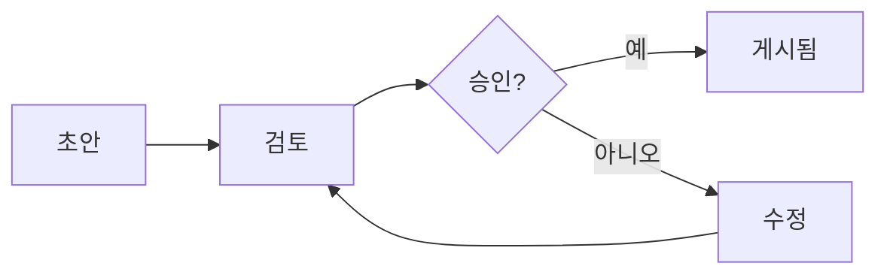

# 📝 Knowledge Database 콘텐츠 관리자 가이드

## 목차
1. [역할 개요](#역할-개요)
2. [콘텐츠 전략](#콘텐츠-전략)
3. [콘텐츠 생성 모범 사례](#콘텐츠-생성-모범-사례)
4. [메타데이터 관리](#메타데이터-관리)
5. [카테고리 구조 설계](#카테고리-구조-설계)
6. [번역 워크플로우](#번역-워크플로우)
7. [대량 가져오기/내보내기](#대량-가져오기내보내기)
8. [콘텐츠 버전 관리](#콘텐츠-버전-관리)
9. [검토 및 승인 프로세스](#검토-및-승인-프로세스)
10. [분석 및 최적화](#분석-및-최적화)

## 역할 개요

### 책임
콘텐츠 관리자로서 귀하의 책임:
- 콘텐츠 품질 및 일관성 유지
- 지식 구조 구성
- 콘텐츠 라이프사이클 관리
- 검색 가능성 보장
- 번역 조정
- 콘텐츠 성과 분석

### 액세스 및 권한
- 모든 콘텐츠 생성 및 편집
- 카테고리 및 태그 관리
- 제출 승인/거부
- 분석 대시보드 액세스
- 대량 작업 수행
- 콘텐츠 워크플로우 구성

## 콘텐츠 전략

### 콘텐츠 계획
1. **지식 격차 식별**
   - 결과가 없는 검색 쿼리 검토
   - 사용자 피드백 분석
   - 업계 동향 모니터링
   - 팀 요구사항 조사

2. **콘텐츠 캘린더**
   - 정기 업데이트 일정
   - 시즌별 콘텐츠 계획
   - 주제 전문가와 조정
   - 게시 마감일 추적

3. **품질 표준**
   - 기사당 최소 500단어
   - 필수 메타데이터 완성
   - 적절한 분류
   - 관련 태깅
   - 출처 표시

## 콘텐츠 생성 모범 사례

### 작성 가이드라인

#### 구조
```markdown
# 명확하고 설명적인 제목

## 요약
2-3문장의 간략한 개요

## 소개
맥락과 배경

## 주요 내용
### 섹션 1
상세 정보

### 섹션 2
보충 세부사항

## 결론
핵심 포인트

## 참고 문헌
- 출처 1
- 출처 2
```

#### 스타일 가이드
- **목소리**: 전문적이면서도 친근한
- **톤**: 정보 제공 및 도움이 되는
- **언어**: 명확하고 간결한
- **형식**: 헤더, 불릿, 표 사용
- **예시**: 실용적인 예시 포함

### SEO 최적화
- 관련 키워드를 자연스럽게 포함
- 설명적인 제목 작성 (50-60자)
- 매력적인 요약 작성 (150-160자)
- 헤더 계층 사용 (H1, H2, H3)
- 이미지에 대체 텍스트 추가

## 메타데이터 관리

### 필수 필드
```yaml
title: "API 통합 완벽 가이드"
category: "기술/소프트웨어 개발"
tags: ["API", "통합", "REST", "개발"]
author: "홍길동"
language: "ko"
status: "published"
visibility: "public"
created_date: "2025-08-21"
last_modified: "2025-08-21"
version: "1.0"
```

### 태그 전략
- 3-7개의 관련 태그 사용
- 광범위한 태그와 구체적인 태그 결합
- 일관된 태그 이름 유지
- 유사한 태그 검토 및 통합
- 적절한 경우 태그 계층 생성

### 관련 콘텐츠 링크
- 필수 지식에 링크
- 고급 주제에 연결
- 관련 절차 참조
- 언어 간 교차 링크
- 링크 무결성 유지

## 카테고리 구조 설계

### 계층 원칙
```
루트 카테고리
├── 주 카테고리 (광범위한 주제)
│   ├── 하위 카테고리 (특정 영역)
│   │   ├── 주제 (상세 주제)
│   │   └── 주제
│   └── 하위 카테고리
└── 주 카테고리
```

### 모범 사례
- 최대 3-4 레벨 깊이
- 카테고리 레벨당 5-10개 항목
- 명확하고 설명적인 이름
- 논리적 그룹화
- 사용자 멘탈 모델 고려

### 구조 예시
```
지식 베이스
├── 제품 및 서비스
│   ├── 제품 A
│   │   ├── 시작하기
│   │   ├── 기능
│   │   └── 문제 해결
│   └── 제품 B
├── 정책 및 절차
│   ├── HR 정책
│   ├── IT 정책
│   └── 안전 절차
└── 교육 및 개발
    ├── 온보딩
    ├── 기술 교육
    └── 자격증
```

## 번역 워크플로우

### 다국어 콘텐츠 관리

#### 번역 프로세스
1. **콘텐츠 준비**
   - 번역할 콘텐츠 표시
   - 우선순위 수준 설정
   - 번역 노트 추가
   - 대상 언어 지정

2. **번역 방법**
   - 전문 번역 서비스
   - 내부 이중 언어 직원
   - AI 지원 번역 + 검토
   - 커뮤니티 기여

3. **품질 보증**
   - 원어민 검토
   - 기술적 정확성 확인
   - 일관성 검증
   - 문화적 적절성

#### 한국어 콘텐츠 가이드라인
- 정식 톤 유지 (존댓말)
- 기술 용어는 영어로 유지하고 한국어 설명 추가
- 예: "API (응용 프로그램 인터페이스)"
- 적절한 문자 인코딩 보장 (UTF-8)

## 대량 가져오기/내보내기

### 가져오기 절차

#### CSV 형식
```csv
title,category,tags,content,author,language,status
"API 가이드","기술","API,REST,통합","콘텐츠...","홍길동","ko","published"
"API Guide","Technology","API,REST,integration","Content here...","John Doe","en","published"
```

#### JSON 형식
```json
{
  "items": [
    {
      "title": "API 통합 가이드",
      "category": "기술/개발",
      "tags": ["API", "REST", "통합"],
      "content": "전체 콘텐츠...",
      "metadata": {
        "author": "홍길동",
        "language": "ko",
        "version": "1.0"
      }
    }
  ]
}
```

### 내보내기 옵션
- **전체 내보내기**: 메타데이터가 있는 모든 콘텐츠
- **필터링된 내보내기**: 날짜, 카테고리 또는 상태별
- **형식 옵션**: CSV, JSON, 마크다운, PDF
- **일정 관리**: 자동 주간/월간 내보내기

## 콘텐츠 버전 관리

### 버전 관리 시스템

#### 버전 번호 지정
- **주 버전** (1.0): 중요한 콘텐츠 변경
- **부 버전** (1.1): 업데이트 및 추가
- **패치 버전** (1.1.1): 사소한 수정

#### 버전 관리
1. 모든 편집이 자동 버전 생성
2. 버전 간 나란히 비교
3. 이전 버전 복원
4. 변경 히스토리 추적
5. 버전 노트 추가

#### 버전 비교
```diff
- 제거된 이전 콘텐츠
+ 추가된 새 콘텐츠
! 수정된 콘텐츠 강조
```

## 검토 및 승인 프로세스

### 워크플로우 단계



### 검토 체크리스트
- [ ] 콘텐츠 정확성 확인
- [ ] 문법 및 맞춤법 검사
- [ ] 일관된 포맷팅
- [ ] 기능적인 링크
- [ ] 최적화된 이미지
- [ ] 완전한 메타데이터
- [ ] 적절한 카테고리
- [ ] 관련 태그

### 승인 기준
1. **기술적 정확성**: 주제 전문가 확인
2. **규정 준수**: 조직 표준 충족
3. **품질**: 최소 요구사항 초과
4. **완전성**: 모든 섹션 존재
5. **접근성**: 읽기 쉽고 이해하기 쉬움

## 분석 및 최적화

### 주요 지표

#### 콘텐츠 성과
- **조회수**: 전체 및 고유 조회수
- **참여도**: 페이지 체류 시간, 스크롤 깊이
- **공유**: 소셜 및 내부 공유
- **피드백**: 평가 및 댓글
- **검색 성과**: 클릭률

#### 대시보드 보고서
```
주간 콘텐츠 보고서
├── 최고 성과 콘텐츠
├── 저조한 성과 콘텐츠
├── 검색어 분석
├── 사용자 피드백 요약
└── 콘텐츠 격차 분석
```

### 최적화 전략

#### 검색 가능성 개선
1. 누락된 쿼리에 대한 검색 로그 분석
2. 동의어 및 관련 용어 추가
3. 제목 및 설명 개선
4. 사용량에 따른 태그 업데이트
5. 콘텐츠 클러스터 생성

#### 참여도 향상
- 시각적 요소 추가 (다이어그램, 스크린샷)
- 대화형 구성 요소 포함
- 긴 콘텐츠를 시리즈로 분할
- 빠른 참조 섹션 추가
- 다운로드 가능한 리소스 생성

### A/B 테스트
- 다른 제목 테스트
- 콘텐츠 형식 비교
- 레이아웃 옵션 평가
- 행동 유도 효과 측정
- 사용자 선호도 최적화

## 도구 및 리소스

### 콘텐츠 관리 도구
- **편집기**: 마크다운 지원이 있는 리치 텍스트 편집기
- **템플릿**: 사전 제작된 콘텐츠 템플릿
- **스타일 검사기**: 문법 및 스타일 유효성 검사
- **링크 검사기**: 깨진 링크 감지
- **이미지 최적화기**: 자동 압축

### 생산성 기능
- 일반 작업을 위한 키보드 단축키
- 여러 항목에 대한 배치 작업
- 콘텐츠 템플릿 및 스니펫
- 자동화된 워크플로우 규칙
- 외부 도구와의 통합

---

**버전**: 1.0.0  
**최종 업데이트**: 2025-08-21  
**지원**: content-team@your-domain.com  
**교육 자료**: 도움말 센터에서 이용 가능