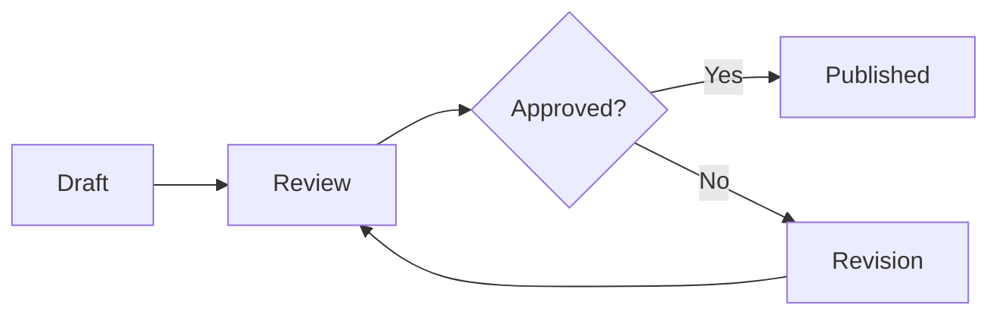

# 📝 Knowledge Database Content Manager Guide

## Table of Contents
1. [Role Overview](#role-overview)
2. [Content Strategy](#content-strategy)
3. [Content Creation Best Practices](#content-creation-best-practices)
4. [Metadata Management](#metadata-management)
5. [Category Structure Design](#category-structure-design)
6. [Translation Workflow](#translation-workflow)
7. [Bulk Import/Export](#bulk-importexport)
8. [Content Versioning](#content-versioning)
9. [Review and Approval Process](#review-and-approval-process)
10. [Analytics and Optimization](#analytics-and-optimization)

## Role Overview

### Responsibilities
As a Content Manager, you are responsible for:
- Maintaining content quality and consistency
- Organizing knowledge structure
- Managing content lifecycle
- Ensuring discoverability
- Coordinating translations
- Analyzing content performance

### Access and Permissions
- Create and edit all content
- Manage categories and tags
- Approve/reject submissions
- Access analytics dashboard
- Perform bulk operations
- Configure content workflows

## Content Strategy

### Content Planning
1. **Identify Knowledge Gaps**
   - Review search queries with no results
   - Analyze user feedback
   - Monitor industry trends
   - Survey team needs

2. **Content Calendar**
   - Schedule regular updates
   - Plan seasonal content
   - Coordinate with subject experts
   - Track publication deadlines

3. **Quality Standards**
   - Minimum 500 words for articles
   - Required metadata completion
   - Proper categorization
   - Relevant tagging
   - Source attribution

## Content Creation Best Practices

### Writing Guidelines

#### Structure
```markdown
# Clear, Descriptive Title

## Executive Summary
Brief overview in 2-3 sentences

## Introduction
Context and background

## Main Content
### Section 1
Detailed information

### Section 2
Supporting details

## Conclusion
Key takeaways

## References
- Source 1
- Source 2
```

#### Style Guide
- **Voice**: Professional yet approachable
- **Tone**: Informative and helpful
- **Language**: Clear and concise
- **Format**: Use headers, bullets, and tables
- **Examples**: Include practical examples

### SEO Optimization
- Include relevant keywords naturally
- Write descriptive titles (50-60 characters)
- Create compelling summaries (150-160 characters)
- Use header hierarchy (H1, H2, H3)
- Add alt text for images

## Metadata Management

### Required Fields
```yaml
title: "Complete Guide to API Integration"
category: "Technology/Software Development"
tags: ["API", "integration", "REST", "development"]
author: "John Doe"
language: "en"
status: "published"
visibility: "public"
created_date: "2025-08-21"
last_modified: "2025-08-21"
version: "1.0"
```

### Tagging Strategy
- Use 3-7 relevant tags
- Combine broad and specific tags
- Maintain consistent tag naming
- Review and consolidate similar tags
- Create tag hierarchies when appropriate

### Related Content Linking
- Link to prerequisite knowledge
- Connect to advanced topics
- Reference related procedures
- Cross-link between languages
- Maintain link integrity

## Category Structure Design

### Hierarchy Principles
```
Root Category
├── Main Category (broad topics)
│   ├── Subcategory (specific areas)
│   │   ├── Topic (detailed subjects)
│   │   └── Topic
│   └── Subcategory
└── Main Category
```

### Best Practices
- Maximum 3-4 levels deep
- 5-10 items per category level
- Clear, descriptive names
- Logical grouping
- Consider user mental models

### Example Structure
```
Knowledge Base
├── Products & Services
│   ├── Product A
│   │   ├── Getting Started
│   │   ├── Features
│   │   └── Troubleshooting
│   └── Product B
├── Policies & Procedures
│   ├── HR Policies
│   ├── IT Policies
│   └── Safety Procedures
└── Training & Development
    ├── Onboarding
    ├── Skills Training
    └── Certifications
```

## Translation Workflow

### Managing Multilingual Content

#### Translation Process
1. **Content Preparation**
   - Mark content for translation
   - Set priority level
   - Add translation notes
   - Specify target languages

2. **Translation Methods**
   - Professional translation service
   - Internal bilingual staff
   - AI-assisted translation + review
   - Community contributions

3. **Quality Assurance**
   - Native speaker review
   - Technical accuracy check
   - Consistency verification
   - Cultural appropriateness

#### Korean Content Guidelines
- Maintain formal tone (존댓말)
- Keep technical terms in English with Korean explanation
- Example: "API (응용 프로그램 인터페이스)"
- Ensure proper character encoding (UTF-8)

## Bulk Import/Export

### Import Procedures

#### CSV Format
```csv
title,category,tags,content,author,language,status
"API Guide","Technology","API,REST,integration","Content here...","John Doe","en","published"
"API 가이드","기술","API,REST,통합","내용...","John Doe","ko","published"
```

#### JSON Format
```json
{
  "items": [
    {
      "title": "API Integration Guide",
      "category": "Technology/Development",
      "tags": ["API", "REST", "integration"],
      "content": "Full content here...",
      "metadata": {
        "author": "John Doe",
        "language": "en",
        "version": "1.0"
      }
    }
  ]
}
```

### Export Options
- **Full Export**: All content with metadata
- **Filtered Export**: By date, category, or status
- **Format Options**: CSV, JSON, Markdown, PDF
- **Scheduling**: Automated weekly/monthly exports

## Content Versioning

### Version Control System

#### Version Numbering
- **Major Version** (1.0): Significant content changes
- **Minor Version** (1.1): Updates and additions
- **Patch Version** (1.1.1): Minor corrections

#### Managing Versions
1. All edits create automatic versions
2. Compare versions side-by-side
3. Restore previous versions
4. Track change history
5. Add version notes

#### Version Comparison
```diff
- Old content that was removed
+ New content that was added
! Modified content highlighted
```

## Review and Approval Process

### Workflow Stages



### Review Checklist
- [ ] Content accuracy verified
- [ ] Grammar and spelling checked
- [ ] Formatting consistent
- [ ] Links functional
- [ ] Images optimized
- [ ] Metadata complete
- [ ] Category appropriate
- [ ] Tags relevant

### Approval Criteria
1. **Technical Accuracy**: Verified by subject expert
2. **Compliance**: Meets organizational standards
3. **Quality**: Exceeds minimum requirements
4. **Completeness**: All sections present
5. **Accessibility**: Readable and understandable

## Analytics and Optimization

### Key Metrics

#### Content Performance
- **Views**: Total and unique views
- **Engagement**: Time on page, scroll depth
- **Shares**: Social and internal sharing
- **Feedback**: Ratings and comments
- **Search Performance**: Click-through rate

#### Dashboard Reports
```
Weekly Content Report
├── Top Performing Content
├── Low Performing Content
├── Search Terms Analysis
├── User Feedback Summary
└── Content Gap Analysis
```

### Optimization Strategies

#### Improve Discoverability
1. Analyze search logs for missed queries
2. Add synonyms and related terms
3. Improve titles and descriptions
4. Update tags based on usage
5. Create content clusters

#### Enhance Engagement
- Add visual elements (diagrams, screenshots)
- Include interactive components
- Break long content into series
- Add quick reference sections
- Create downloadable resources

### A/B Testing
- Test different titles
- Compare content formats
- Evaluate layout options
- Measure call-to-action effectiveness
- Optimize for user preference

## Tools and Resources

### Content Management Tools
- **Editor**: Rich text editor with Markdown support
- **Templates**: Pre-built content templates
- **Style Checker**: Grammar and style validation
- **Link Checker**: Broken link detection
- **Image Optimizer**: Automatic compression

### Productivity Features
- Keyboard shortcuts for common actions
- Batch operations for multiple items
- Content templates and snippets
- Automated workflow rules
- Integration with external tools

---

**Version**: 1.0.0  
**Last Updated**: 2025-08-21  
**Support**: content-team@your-domain.com  
**Training Materials**: Available in Help Center